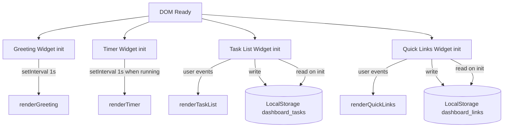

# Design Document: To-Do Life Dashboard

## Overview

The To-Do Life Dashboard is a single-page, client-side web application that acts as a personal productivity homepage. It is built with plain HTML, CSS, and Vanilla JavaScript — no frameworks, no build tools, no server. The entire application lives in three files:

```
index.html       ← markup and structure
css/style.css    ← all styling and responsive layout
js/app.js        ← all logic and DOM interaction
```

The application is opened directly from the file system (via `file://` protocol) and persists all state using the browser's `window.localStorage` API.

### Key Design Goals

- **Zero dependencies** — no npm, no CDN scripts, no third-party libraries.
- **Single source of truth per widget** — each widget manages its own in-memory state and syncs to LocalStorage on every mutation.
- **Pure logic functions** — formatting, validation, and state transitions are implemented as pure functions, making them independently testable.
- **Clean file separation** — HTML defines structure, CSS handles presentation, JS handles all behaviour. No inline styles or inline event handlers in HTML.

---

## Architecture

The application uses a simple **widget-based architecture** without a reactive framework. Each widget is a self-contained module that:

1. Owns an in-memory state object.
2. Exposes pure functions for state transitions and formatting.
3. Renders to the DOM by updating specific elements.
4. Persists to LocalStorage on every mutation.

There is no global event bus or shared state between widgets. The four widgets (Greeting, Timer, Task List, Quick Links) are initialised independently when the DOM is ready.



### Execution Flow

```
file:// open index.html
  browser parses HTML
  browser loads css/style.css
  browser loads js/app.js (defer attribute)
    DOMContentLoaded fires
      initGreeting()
      initTimer()
      initTaskList()
      initQuickLinks()
```

---

## Components and Interfaces

### 1. Greeting Widget

**Responsibility:** Display current time (HH:MM:SS), current date (DayName, DD MonthName YYYY), and a time-based greeting.

**DOM elements (by id):**
- `#greeting-text` — greeting string
- `#time-display` — current time string
- `#date-display` — current date string

**Key functions:**

```javascript
// Returns "HH:MM:SS" with zero-padding; returns "--:--:--" if date is invalid
formatTime(date)

// Returns "DayName, DD MonthName YYYY"; returns "Date unavailable" if date is invalid
formatDate(date)

// hour [5,11] → "Good Morning"
// hour [12,17] → "Good Afternoon"
// hour [0,4] or [18,23] → "Good Evening"
getGreeting(hour)

// Sets up setInterval(renderGreeting, 1000) and calls renderGreeting() immediately
initGreeting()

// Creates new Date(), calls formatTime/formatDate/getGreeting, updates DOM
renderGreeting()
```

**Error handling:** If `new Date()` returns an invalid date, `formatTime` and `formatDate` return static fallback strings. No uncaught exceptions are thrown.

---

### 2. Timer Widget

**Responsibility:** Provide a 25-minute Pomodoro countdown timer with start, stop (pause), and reset controls.

**DOM elements (by id):**
- `#timer-display` — MM:SS formatted remaining time
- `#timer-start` — start/resume button
- `#timer-stop` — stop/pause button
- `#timer-reset` — reset button
- `#timer-alert` — alert banner shown on completion (hidden by default)

**Timer state object (in-memory only, not persisted):**

```javascript
{
  remainingSeconds: number,  // 0 to 1500
  status: 'idle' | 'running' | 'paused' | 'completed',
  intervalId: number | null  // setInterval handle
}
```

**Key pure functions:**

```javascript
// Returns "MM:SS" — e.g., 1500 → "25:00", 65 → "01:05"
formatTimerDisplay(seconds)

// Returns { startDisabled, stopDisabled } based on status
// 'running'   → { startDisabled: true,  stopDisabled: false }
// all others  → { startDisabled: false, stopDisabled: true  }
getTimerControlState(status)

// Returns new state with remainingSeconds - 1
// When remainingSeconds reaches 0, returns state with status 'completed'
tick(state)

// Returns { remainingSeconds: 1500, status: 'idle', intervalId: null }
resetState()
```

**Stateful functions:** `startTimer()`, `pauseTimer()`, `resetTimer()` manage the `setInterval` handle and call `renderTimer()`.

**Alert behaviour:** When `status === 'completed'`, `#timer-alert` becomes visible and a short beep is generated using the Web Audio API (no external audio file required). The alert is dismissed when the user clicks it or presses reset.

**Design decision — Web Audio API:** The app runs from `file://`, so embedding audio is avoided. A short oscillator-based beep via `AudioContext` is self-contained and works without network access. The `AudioContext` is created lazily on first user interaction to satisfy browser autoplay policies.

**Design decision — timer not persisted:** The timer state is intentionally not saved to LocalStorage. On every page load the timer resets to 25:00 idle. Persisting a mid-session timer would cause confusing state where the countdown appears active without the user's awareness.

---

### 3. Task List Widget

**Responsibility:** Manage a persistent list of tasks — add, edit, toggle completion, delete.

**DOM elements:**
- `#task-input` — text input for new task
- `#task-add-btn` — submission button
- `#task-list` — `<ul>` container; `<li>` elements are rendered dynamically

**Task data model:**

```javascript
{
  id: string,        // generated via Date.now().toString() or crypto.randomUUID()
  text: string,      // trimmed, 1–500 chars
  completed: boolean // false by default
}
```

**LocalStorage key:** `"dashboard_tasks"`

**Key pure functions:**

```javascript
// true if text.trim().length > 0 && text.trim().length <= 500
isValidTaskText(text)

// Returns new array with task appended (trimmed, completed: false, new id)
// Returns tasks unchanged if !isValidTaskText(text)
addTask(tasks, text)

// Returns new array without the task matching id
deleteTask(tasks, id)

// Returns new array with the task's text updated to newText.trim()
// Returns tasks unchanged if !isValidTaskText(newText)
editTask(tasks, id, newText)

// Returns new array with the task's completed boolean toggled
toggleTask(tasks, id)

// localStorage.setItem("dashboard_tasks", JSON.stringify(tasks))
saveTasks(tasks)

// Returns parsed array from localStorage; returns [] on any error
loadTasks()

// Rebuilds #task-list DOM from tasks array
renderTaskList(tasks)
```

**Edit mode:** At most one task is in edit mode at a time, tracked by a module-level `editingTaskId`. When the user opens edit on a second task, the first is discarded back to display mode before the new one enters edit mode. Edit is committed on confirm button click or Enter key; cancelled on Escape key or cancel button.

**Re-render strategy:** On every mutation, `renderTaskList` rebuilds the full `#task-list` innerHTML. Given the expected scale (tens of items), this is simpler and more reliable than targeted DOM patching.

---

### 4. Quick Links Widget

**Responsibility:** Manage a persistent list of labelled URL shortcuts displayed as clickable buttons.

**DOM elements:**
- `#link-label-input` — text input for link label
- `#link-url-input` — text input for URL
- `#link-add-btn` — submission button
- `#quick-links-list` — container for rendered link items

**Link data model:**

```javascript
{
  id: string,    // generated via Date.now().toString() or crypto.randomUUID()
  label: string, // non-empty, trimmed
  url: string    // must start with "http://" or "https://"
}
```

**LocalStorage key:** `"dashboard_links"`

**Key pure functions:**

```javascript
// true if label.trim().length > 0 && /^https?:\/\//i.test(url)
isValidLink(label, url)

// Returns new array with link appended
// Returns links unchanged if !isValidLink(label, url)
addLink(links, label, url)

// Returns new array without the link matching id
deleteLink(links, id)

// localStorage.setItem("dashboard_links", JSON.stringify(links))
saveLinks(links)

// Returns parsed array from localStorage; returns [] on any error
loadLinks()

// Rebuilds #quick-links-list DOM from links array
renderQuickLinks(links)
```

**Security:** Link elements use `<a href="..." target="_blank" rel="noopener noreferrer">` to prevent reverse tabnapping. URL values are assigned to `href` attributes only — no `eval`, `innerHTML`, or `window.open` with string concatenation.

---

## Data Models

### Task — stored at `"dashboard_tasks"`

```json
[
  { "id": "1724668800000", "text": "Write design doc", "completed": false },
  { "id": "1724668801234", "text": "Review requirements", "completed": true }
]
```

### Link — stored at `"dashboard_links"`

```json
[
  { "id": "1724668900000", "label": "GitHub", "url": "https://github.com" },
  { "id": "1724668901234", "label": "MDN", "url": "https://developer.mozilla.org" }
]
```

### Serialisation Contract

Both collections are stored as JSON-serialised arrays. The serialisation/deserialisation cycle must be lossless: `JSON.parse(JSON.stringify(collection))` must produce an equivalent array where every item has identical field values to the original.

### Timer State (in-memory only — not persisted)

```javascript
{ remainingSeconds: 1500, status: 'idle', intervalId: null }
```

---

## Correctness Properties

*A property is a characteristic or behavior that should hold true across all valid executions of a system — essentially, a formal statement about what the system should do. Properties serve as the bridge between human-readable specifications and machine-verifiable correctness guarantees.*

### Property 1: Time formatting produces a valid HH:MM:SS string

*For any* valid `Date` object, `formatTime(date)` shall return a string matching the pattern `HH:MM:SS` where HH is the zero-padded 24-hour value (00–23), MM is zero-padded minutes (00–59), and SS is zero-padded seconds (00–59), with each segment matching the corresponding value from the input date.

**Validates: Requirements 1.1**

---

### Property 2: Date formatting produces the correct human-readable string

*For any* valid `Date` object, `formatDate(date)` shall return a string in the form `"DayName, DD MonthName YYYY"` where DayName is the correct English day name, DD is the zero-padded day of month, MonthName is the correct English month name, and YYYY is the four-digit year matching the input date.

**Validates: Requirements 1.2**

---

### Property 3: Greeting is correct for any hour of the day

*For any* integer hour in [0, 23], `getGreeting(hour)` shall return exactly `"Good Morning"` for hours [5, 11], `"Good Afternoon"` for hours [12, 17], and `"Good Evening"` for all other hours ([0, 4] and [18, 23]).

**Validates: Requirements 1.3, 1.4, 1.5**

---

### Property 4: Timer display formatting is always a valid MM:SS string

*For any* integer `seconds` in [0, 1500], `formatTimerDisplay(seconds)` shall return a string in `MM:SS` format where the minute component equals `Math.floor(seconds / 60)` and the second component equals `seconds % 60`, both zero-padded to two digits.

**Validates: Requirements 2.3**

---

### Property 5: Timer tick decrements by exactly one second

*For any* timer state with `status === 'running'` and `remainingSeconds > 1`, applying `tick(state)` shall return a new state with `remainingSeconds === state.remainingSeconds - 1` and `status === 'running'`. When `remainingSeconds === 1`, `tick(state)` shall return a state with `remainingSeconds === 0` and `status === 'completed'`.

**Validates: Requirements 2.2, 2.6**

---

### Property 6: Timer reset always returns the canonical idle state

*For any* timer state (any `status`, any `remainingSeconds`), `resetState()` shall return a state with `remainingSeconds === 1500` and `status === 'idle'`.

**Validates: Requirements 2.1, 2.5**

---

### Property 7: Timer control states are consistent with timer status

*For any* timer status value, `getTimerControlState(status)` shall return `startDisabled === true` if and only if `status === 'running'`, and `stopDisabled === true` if and only if `status !== 'running'`.

**Validates: Requirements 2.7, 2.8**

---

### Property 8: Invalid task text is always rejected without mutation

*For any* tasks array and any string `text` that is either entirely whitespace or has a trimmed length greater than 500 characters, `addTask(tasks, text)` shall return the original `tasks` array unchanged (same length, same items).

**Validates: Requirements 3.3, 3.4**

---

### Property 9: Adding a valid task appends it with correct initial state

*For any* tasks array and any valid task text `t` (non-empty trimmed, length ≤ 500), `addTask(tasks, t)` shall return an array of length `tasks.length + 1` where the appended task has `text === t.trim()` and `completed === false`, and all existing tasks are unchanged.

**Validates: Requirements 3.2**

---

### Property 10: Deleting a task removes exactly that task

*For any* tasks array and any task `id` present in that array, `deleteTask(tasks, id)` shall return an array of length `tasks.length - 1` that contains no task with that `id` and contains all other tasks unchanged.

**Validates: Requirements 6.2**

---

### Property 11: Editing with invalid text is rejected

*For any* tasks array and any string `newText` that is empty or whitespace-only, `editTask(tasks, id, newText)` shall return the original `tasks` array unchanged.

**Validates: Requirements 4.5**

---

### Property 12: Editing with valid text updates only the target task

*For any* tasks array, any task `id` present in that array, and any valid `newText`, `editTask(tasks, id, newText)` shall return an array of the same length where the task with `id` has `text === newText.trim()` and all other tasks are unchanged.

**Validates: Requirements 4.4**

---

### Property 13: Completion toggle is a round trip (double-toggle restores original state)

*For any* tasks array and any task `id`, applying `toggleTask` twice shall return an array where the task with `id` has the same `completed` value as the original, and all other tasks are unchanged.

**Validates: Requirements 5.2, 5.3**

---

### Property 14: Task collection round-trip serialisation is lossless

*For any* valid tasks array, `JSON.parse(JSON.stringify(tasks))` shall produce an array of the same length where every task has identical `text` and `completed` values as the original.

**Validates: Requirements 7.3, 7.4**

---

### Property 15: Link URL validation accepts exactly http/https URLs

*For any* non-empty label and any URL string, `isValidLink(label, url)` shall return `true` if and only if the URL begins with `"http://"` or `"https://"` (case-insensitive), and `false` for all other URL patterns including empty strings and relative paths.

**Validates: Requirements 8.2, 8.3**

---

### Property 16: Link collection round-trip serialisation is lossless

*For any* valid links array, `JSON.parse(JSON.stringify(links))` shall produce an array of the same length where every link has identical `label` and `url` values as the original.

**Validates: Requirements 8.7, 8.8**

---

## Error Handling

| Scenario | Behaviour |
|---|---|
| `new Date()` returns invalid date | `formatTime` / `formatDate` return static fallback strings; no thrown error |
| `localStorage.getItem("dashboard_tasks")` returns null | `loadTasks()` returns `[]` |
| `localStorage.getItem("dashboard_tasks")` contains invalid JSON | `loadTasks()` catches the `SyntaxError` and returns `[]` |
| `localStorage.getItem("dashboard_links")` returns null | `loadLinks()` returns `[]` |
| `localStorage.getItem("dashboard_links")` contains invalid JSON | `loadLinks()` catches the `SyntaxError` and returns `[]` |
| `localStorage.setItem` throws (e.g., storage quota exceeded) | Error is caught and logged to console; UI state is preserved |
| `AudioContext` creation or beep fails | Error is caught silently; the visual alert still displays |
| Task text empty or whitespace-only | `addTask` / `editTask` return collection unchanged; UI shows validation message |
| Task text > 500 chars | `addTask` returns collection unchanged; UI shows validation message |
| Link label empty or URL invalid | `addLink` returns collection unchanged; UI shows validation message |

All user-facing errors are surfaced as inline validation messages adjacent to the relevant input, not as `alert()` dialogs or thrown exceptions.

---

## Testing Strategy

### Dual Testing Approach

This feature uses two complementary testing strategies:

1. **Property-based tests** — verify universal properties across many randomly generated inputs (100+ iterations each).
2. **Unit tests (example-based)** — verify specific scenarios, edge cases, and integration points.

### Property-Based Testing

The feature is well-suited for property-based testing because it contains a number of pure functions (formatters, validators, state transition functions) whose correctness must hold across the full input space. Randomised inputs are particularly valuable for catching off-by-one errors in time/date formatting, timer boundary conditions, and validation logic.

**Library:** [fast-check](https://fast-check.dev/) for JavaScript, run in Node.js via a simple test runner (e.g., the built-in `node:test` module available in Node 18+, or a minimal test file using `fast-check` directly). No build tool is required — the tests run in Node, separate from the `file://` browser app.

**Minimum iterations:** 100 per property test.

**Tagging convention:** Each property test includes a comment referencing its design property:
```javascript
// Feature: todo-life-dashboard, Property 3: Greeting is correct for any hour of the day
```

**Properties to implement as property-based tests:**

| Property | Function(s) under test | Generator strategy |
|---|---|---|
| 1 — Time formatting | `formatTime` | `fc.date()` |
| 2 — Date formatting | `formatDate` | `fc.date()` |
| 3 — Greeting by hour | `getGreeting` | `fc.integer({ min: 0, max: 23 })` |
| 4 — Timer display format | `formatTimerDisplay` | `fc.integer({ min: 0, max: 1500 })` |
| 5 — Timer tick | `tick` | `fc.integer({ min: 1, max: 1500 })` for remainingSeconds |
| 6 — Timer reset | `resetState` | Any timer state |
| 7 — Timer control states | `getTimerControlState` | `fc.constantFrom('idle', 'running', 'paused', 'completed')` |
| 8 — Invalid task rejected | `addTask` | `fc.string()` filtered to whitespace-only or length > 500 |
| 9 — Valid task appended | `addTask` | `fc.array(taskArb)` + `fc.string({ minLength: 1 })` |
| 10 — Delete removes task | `deleteTask` | `fc.array(taskArb, { minLength: 1 })` |
| 11 — Edit invalid rejected | `editTask` | Whitespace string generators |
| 12 — Edit valid updates | `editTask` | `fc.array(taskArb)` + valid `newText` |
| 13 — Toggle round trip | `toggleTask` | `fc.array(taskArb, { minLength: 1 })` |
| 14 — Task round-trip | `JSON.parse/stringify` | `fc.array(taskArb)` |
| 15 — Link URL validation | `isValidLink` | `fc.webUrl()` + `fc.string()` |
| 16 — Link round-trip | `JSON.parse/stringify` | `fc.array(linkArb)` |

### Unit Tests (Example-Based)

Unit tests cover specific scenarios and edge cases that complement the property tests:

- Timer initialises with `remainingSeconds === 1500` and `status === 'idle'`.
- `pauseTimer` on a running timer sets `status === 'paused'` and retains `remainingSeconds`.
- `startTimer` on a paused timer resumes from the retained `remainingSeconds`.
- `loadTasks()` returns `[]` when localStorage key is absent.
- `loadTasks()` returns `[]` and does not throw when localStorage contains `"not-json"`.
- `loadLinks()` returns `[]` when localStorage key is absent.
- `loadLinks()` returns `[]` and does not throw when localStorage contains `"not-json"`.
- Activating a second task's edit control while one is already open discards the first task's edits.
- `formatTime` returns `"--:--:--"` when passed `new Date("invalid")`.
- `formatDate` returns `"Date unavailable"` when passed `new Date("invalid")`.

### Manual / Browser Tests

Some requirements cannot be verified by automated unit tests and require manual verification:

| Requirement | Test approach |
|---|---|
| Responsive layout at 320px–2560px | DevTools device emulation at key breakpoints |
| Font size ≥ 14px at all widths | DevTools computed styles inspection |
| Controls not obscured at any width | Visual inspection at mobile/tablet/desktop |
| Audible alert on timer completion | Manual test in each browser |
| Works in Chrome, Firefox, Edge, Safari | Open `index.html` directly in each browser |
| `file://` protocol compatibility | Open without a local server |
| Links open in new tab | Manual click test |
